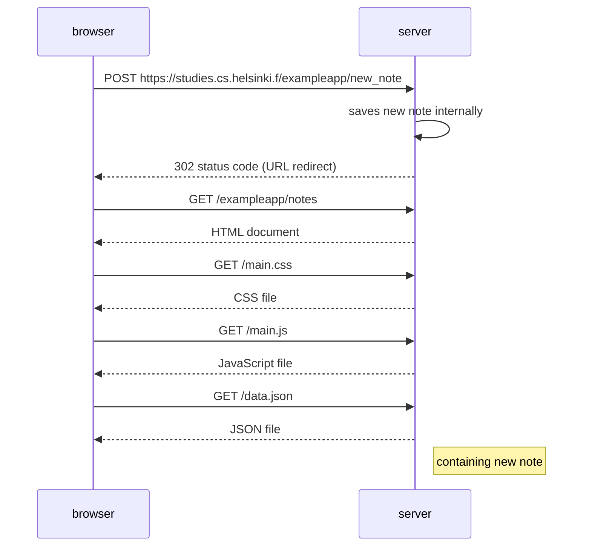

```mermaid
sequenceDiagram
    participant browser
    participant server

    browser->>server: POST https://studies.cs.helsinki.f/exampleapp/new_note
    server->>server: saves new note internally
    server-->>browser: 302 status code (URL redirect)

    browser->>server: GET /exampleapp/notes
    server-->>browser: HTML document

    browser->>server: GET /main.css
    server-->>browser: CSS file

    browser->>server: GET /main.js
    server-->>browser: JavaScript file

    browser->>server: GET /data.json
    server-->>browser: JSON file
    Note right of server: containing new note
```
