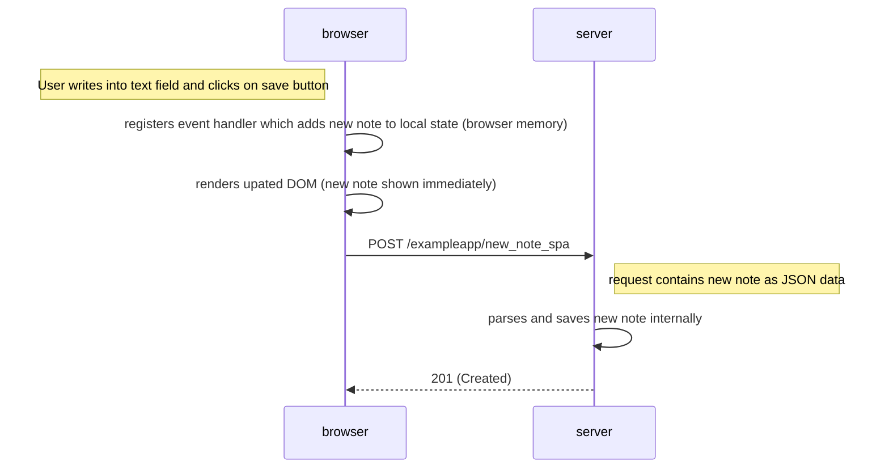

```mermaid
sequenceDiagram
    participant browser
    participant server

    Note left of browser: User writes into text field and clicks on save button
    browser->>browser: registers event handler which adds new note to local state (browser memory)
    browser->>browser: renders upated DOM (new note shown immediately)

    browser->>server: POST /exampleapp/new_note_spa
    Note right of server: request contains new note as JSON data

    server->>server: parses and saves new note internally
    server-->>browser: 201 (Created)
```
